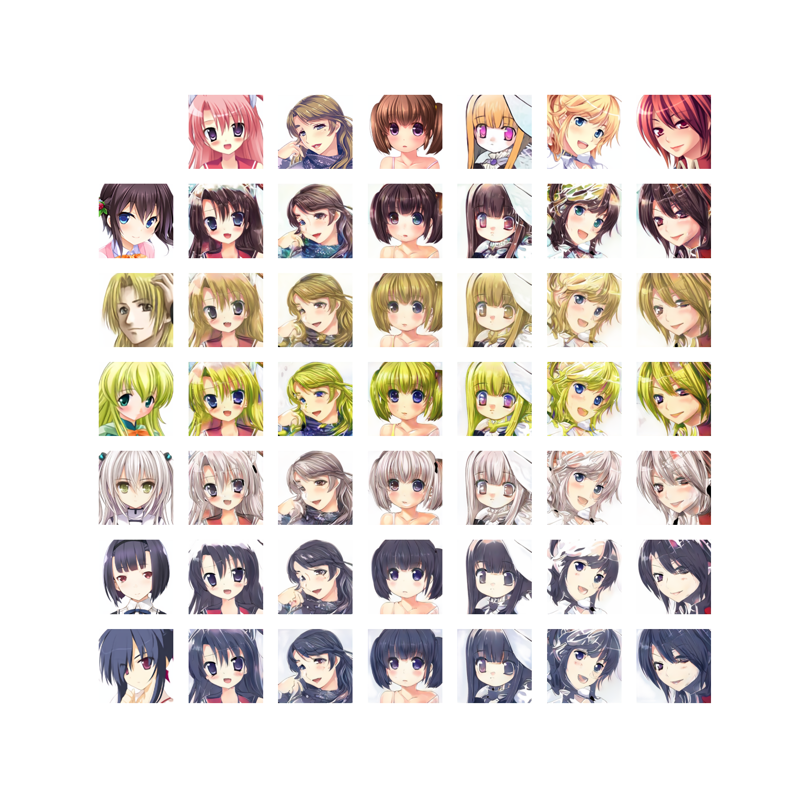
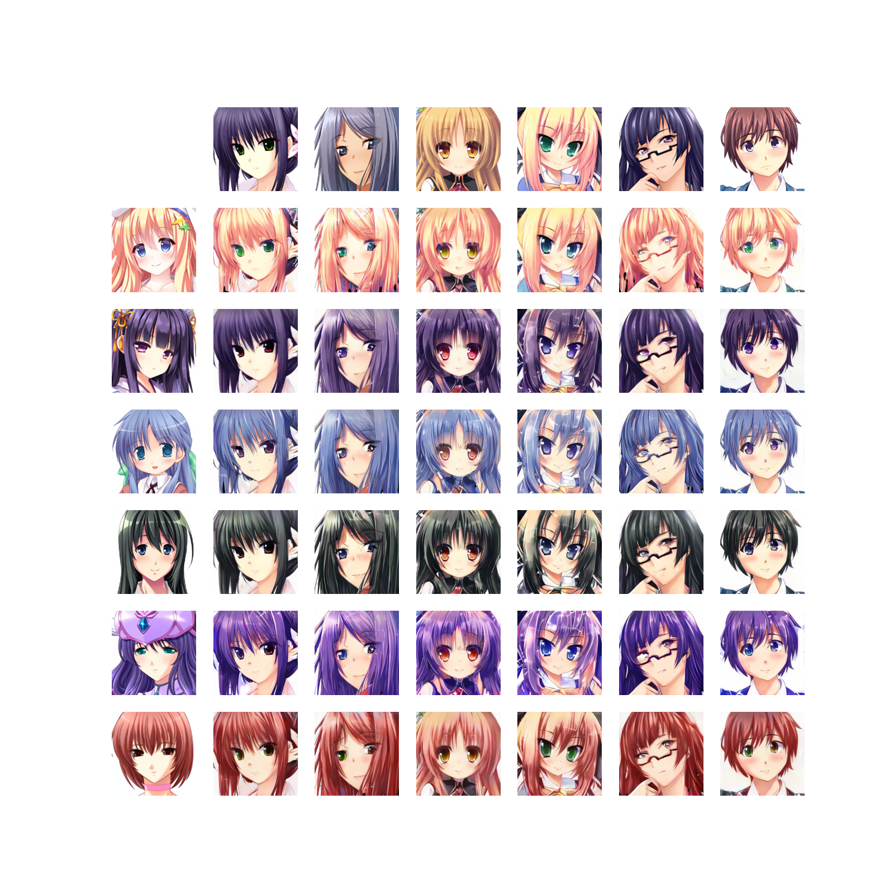
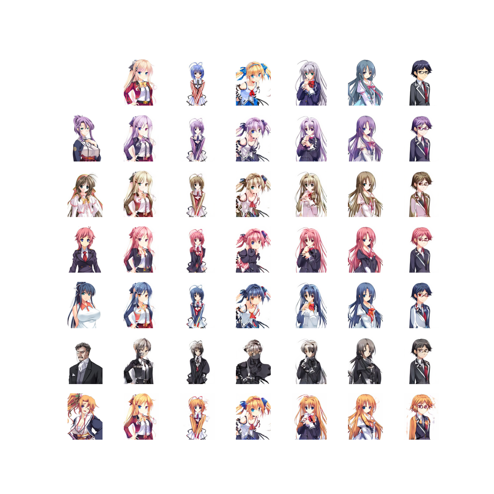

# Image Manupilation

## Overview


- Manupilate source images as they adapt to reference images

## Usage
```bash
$ python train.py --data_path <DATA_PATH>
```
- `DATA_PATH`: Path name that contains images

## Results
| Examples |
| ---- |
|  |
|  |
|  |
|  |
|  |
|  |
|  |
|  |
|  |
|  |
|  |
|  |
|  |
|  |
|  |

## References
- [Swapping Autoencoder for Deep Image Manipulation](https://arxiv.org/pdf/2007.00653.pdf)
- [Analyzing and Improving the Image Quality of StyleGAN](https://arxiv.org/pdf/1912.04958.pdf)
- [A Style-Based Generator Architecture for Generative Adversarial Networks](https://arxiv.org/pdf/1812.04948.pdf)